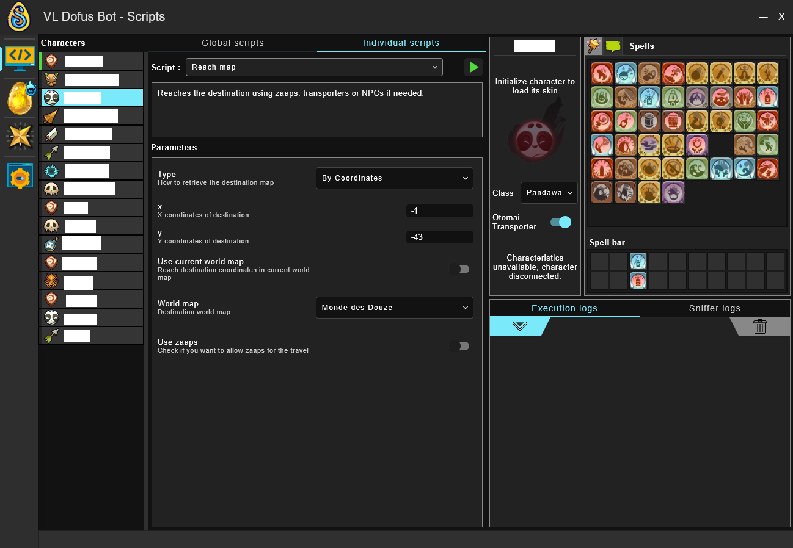

# VLDofusBot

Welcome to VLDofusBot, this bot's goal is to help you automatize tedious tasks in the game. This is not a socket bot, it
will sniff the network to read the game's packets and will simulate clicks on the game window. No message will be sent
to the game server directly by the bot.

You can suggest new features or find help on discord : https://discord.gg/v45AA3dtYz

## Features

- [x] Move multiple characters at once using zaaps if needed, see it as an improved autopilot.
- [x] Explore all zaaps you're missing.
- [x] Explore areas to look for archmonsters, quest monsters, or just to kill present monsters.
- [x] Automatically update Metamob and display quest advancement.
- [x] Treasure hunts (this one should be half checked as it works but is not finished. You can
  check [this issue](https://github.com/viclew1/VLDofusBot/issues/8) to learn how to use it).
- [x] Smith magic (only 1 recipe for now, but everything's ready to implement more)
- [ ] Raise mounts
- [ ] Fight in arena
- [ ] Harvest jobs resources
- [ ] Return to bank when inventory full
- [ ] Dungeons + challenges
- [ ] Game's chat visible in the bot interface
- [ ] Fight Dopples

## Getting started

To get started, you'll first need to install the bot. For this, you'll need :

- gradle version 6.9 (I've noticed issues with versions 7+) : [Download](https://gradle.org/releases/)
- Git : [Download](https://git-scm.com/downloads)
- Npcap to use the
  sniffer ([VLDofusBotSniffer](https://github.com/viclew1/VLDofusBotSniffer)) : [Download](https://npcap.com/#download)

To install or work on this project, you'll need to clone all the repositories
(using [VLDofusBotModulesBuilder](https://github.com/viclew1/VLDofusBotModulesBuilder)). Open a cmd where you want to
install the bot and type these commands :

- ```git clone https://github.com/viclew1/VLDofusBotModulesBuilder```
- ```cd VLDofusBotModulesBuilder```
- ```git submodule update --init```
- ```git submodule foreach git checkout master```
- ```gradle build```

Then, you can launch the built jar located in VLDofusBot\build\libs\VLDofusBot-X.jar

### Set up your game UI

You now need to avoid having elements in the way of clicks the bot can make, that means leaving all cells of the game
grid free of any UI element.


Another important thing is to disable display of all monsters in a group.

## Tabs

### Loading

When starting VLDofusBot, you'll be greeted by this window :


If one of the operations fail, you'll get an error message describing what went wrong.
Most likely cases are :

- You don't have npcap installed (refer to [Getting started](#getting-started))
- You don't have the game installed, or it is installed in a custom location
  (not C:/users/your_profile/AppData/Local/Ankama/Dofus), the fix would be to install it in the default location or to
  put this location in your path variable.
- One of the bot's files (stored in C:/users/your_profile/.VLDofusBot) is badly formatted

### Scripts

Once every loading operation has succeeded, well done, the bot should be usable ! You'll arrive to the scripts tab.
You can reach the other tabs with the buttons on the left.

#### Characters

On the left, there's a characters list. New characters are automatically added to it when you log them into the game.
They can have four different activity states, you can notice them using the colored bar on the left on the character's
card :

- Disconnected

  
- To initialize

  
- Available

  
- Busy

  

#### Global scripts

The page is, by default, in **Global** mode. Meaning you can run a script for multiple characters at once. Here I have
two characters selected on which the selected script will run.


#### Individual scripts

If you select a character (by clicking on its card), you'll enter **Individual** mode. In this mode, you can edit
your character's AI and run scripts only for him.

On the right, you can edit the spells your character will use when fighting.



If you want to return in Global mode, click on the **Global scripts** tab.

### Settings

If you move to the **Settings** tab, you'll be able to configure your bot. You can activate on not the sound alerts when
meeting an archmonster or a quest monster, enable overlays (feature in progress), set your metamob helper settings.


### Metamob Helper

#### How to use

You'll first need to set your metamob profile configuration which will be needed to
use Metamob Helper and to automatically update your account with the monsters you buy, capture or
trade. To disable these features, uncheck them under the **Metamob configuration** in the settings tab.

Start by fully synchronizing your game account with your metamob's account by putting every soulstone you own in a
character's haven bag chest, then running the script **Update Metamob** on this character.

Every time you update your monsters, the archmonster you don't own will have their statuses changed to *searched* and
the ones you have multiple times will be changed to *offered*.

#### Monsters display

You can dynamically view your metamob monsters in this tab. You can filter the list and check what you've caught, what
you're missing, etc. It will be automatically updated every time a monster event is received (capture, trade,
purchase) but you can also manually refresh it if needed.


